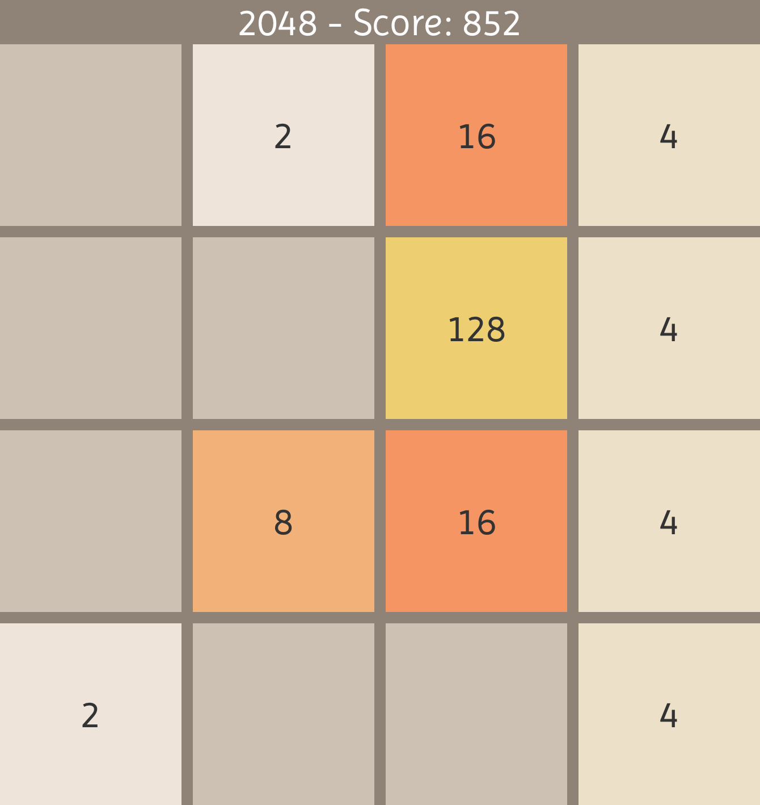

# 2048



### Build and Run

#### Use the gradle wrapper to make sure the application works properly!

```sh
# building the application ...
./gradlew clean build
./gradlew run
# testing the implementation ...
./gradlew test
```

### Generating and executing Jar-File

```sh
./gradlew clean build shadowJar
java --module-path $PATH_TO_FX --add-modules javafx.controls -jar app/build/libs/twentyFortyEight.jar
```

#### Author: 
[nocheatoriginal](https://github.com/nocheatoriginal)